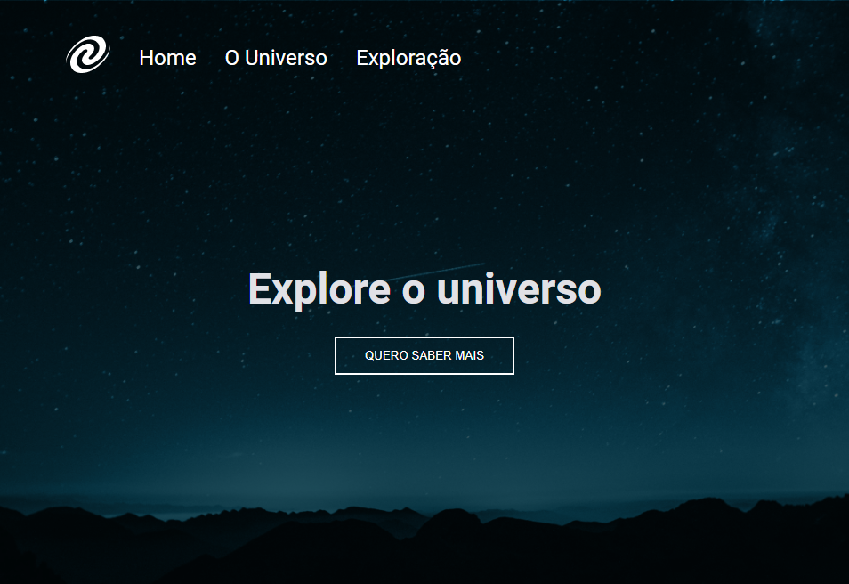

# Explorer (Rocketseat)

> Trilha Explorer

Projeto construido no stage 6 do curso Explorer da Rocketseat

[Clique aqui para acessar](https://projeto-07.vercel.app/)

## Tecnologias

- HTML
- CSS
- Git e Github

## O que aprendi

- Conceitos de SPA (Single Page Application)
- Eventos no JavaScript
- Assincronismo
- Promises
- Conceitos de POO (Programação Orientada a Objeto)

## Contato

beto.balmant@hotmail.com
